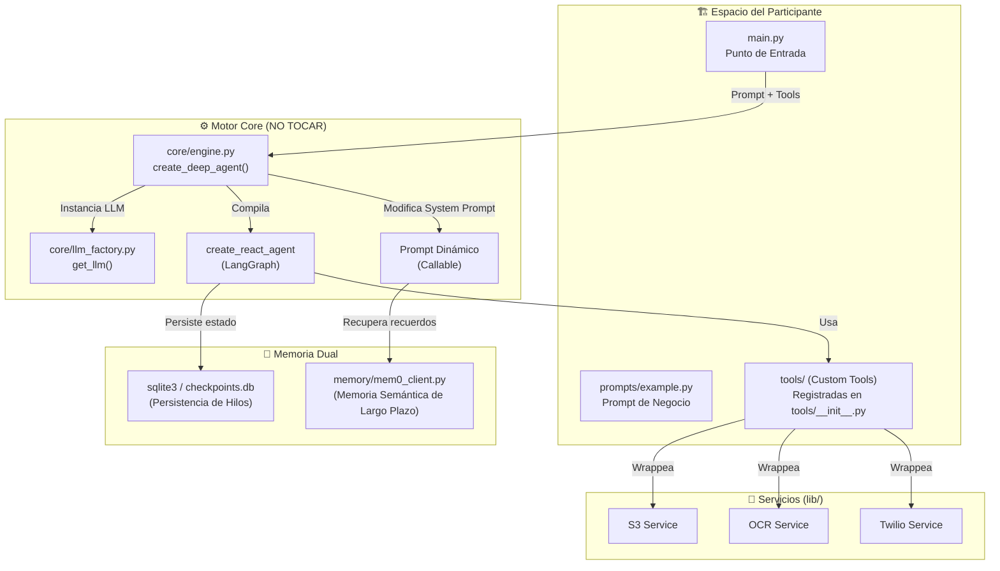

# 🚀 Deep Agent B2B Sales Starter-Kit

¡Bienvenido al **Starter-Kit de Agentes Profundos (Deep Agents)** para el Hackathon B2B! Este Boilerplate está diseñado para abstraer toda la complejidad técnica de la orquestación de agentes, reintentos de herramientas, y persistencia de memoria para que los equipos puedan enfocarse en lo que realmente importa: **ajustar prompts comerciales y crear herramientas potentes**.

---

## 🏗️ Arquitectura de Memoria Dual y Orquestación

Este Starter-Kit implementa un patrón **ReAct (Reasoning + Acting)** de producción con las siguientes características clave:



### 1. Persistencia de Estado (Checkpointing) — Memoria a Corto Plazo
El motor está conectado a un `SqliteSaver` local (`checkpoints.db`). Cada paso que da el agente, cada llamada a herramientas y cada parte de la conversación queda grabada en un **Thread**. Si el servidor falla, el agente se puede reanudar exactamente desde el nodo donde se interrumpió simplemente pasándole el mismo `--thread-id`.

### 2. Memoria Semántica (Largo Plazo) — Mem0 (Integración Externa)
El starter-kit expone un wrapper para **Mem0** en `memory/mem0_client.py`. Este cliente se encarga de:
- **Extraer hechos:** Al finalizar un flujo, se sincronizan las interacciones relevantes y Mem0 extrae hechos de forma automática.
- **Búsqueda Semántica:** En cada turno de la conversación, se consultan semánticamente recuerdos del cliente (`user_id`) y se inyectan dinámicamente en el System Prompt a través del modificador dinámico de prompts.

### 3. Factory de LLM Multi-Proveedor
El agente no está atado a OpenAI. Los participantes pueden configurar cualquiera de estos proveedores en su `.env`:
- **OpenAI** (ej: `gpt-4o`)
- **Google / Gemini** (ej: `gemini-1.5-flash`)
- **Anthropic** (ej: `claude-3-5-sonnet-latest`)

---

## 📂 Organización de Carpetas

La arquitectura del starter-kit está estrictamente segmentada para evitar errores en producción:

```
agents-starterkit/
├── core/                            # ⚙️ MOTOR CORE (NO MODIFICAR)
│   ├── engine.py                    # Compilación de create_react_agent y ejecución asíncrona
│   └── llm_factory.py               # Instanciación dinámica del LLM (OpenAI, Gemini, Anthropic)
├── memory/                          # 🧠 MEMORIA SEMÁNTICA (INTEGRACIÓN EXTERNA)
│   └── mem0_client.py               # Wrapper de Mem0 para add_memory y get_context
├── config/                          # 🔧 CONFIGURACIÓN
│   └── config.py                    # Carga de variables de entorno con dotenv
├── prompts/                         # 📝 PROMPTS (Espacio del Participante)
│   ├── example.py                   # System prompt de ventas B2B
│   └── README.md                    # Guía para redactar prompts
├── example/                         # 💡 NUEVO: EJEMPLO DE AGENTE Y ORQUESTACIÓN
│   └── agent_demo.py                # Script demo interactivo paso a paso (Memoria Dual)
├── tools/                           # 🛠️ HERRAMIENTAS (Espacio del Participante)
│   ├── __init__.py                  # Registro maestro de herramientas (ALL_TOOLS)
│   ├── cloud/aws/aws_tools.py       # Herramientas de AWS S3 y OCR (Textract)
│   └── whatsapp/whatsapp_tools.py   # Herramientas de WhatsApp (Twilio)
├── main.py                          # 🚀 PUNTO DE ENTRADA (Orquestación del Flujo)
├── pyproject.toml                   # Dependencias de Python gestionadas con UV
└── checkpoints.db                   # Base de datos SQLite creada en la primera ejecución
```

---

## 🛠️ Configuración Inicial

1. **Instalar dependencias:**
   Este starter-kit utiliza [uv](https://github.com/astral-sh/uv) para la gestión de dependencias de Python:
   ```bash
   uv sync
   ```

2. **Configurar el archivo `.env`:**
   Copia el archivo `.env.example` (o crea uno nuevo) y añade tus credenciales:
   ```env
   # Proveedor de LLM (openai | gemini | anthropic)
   LLM_PROVIDER=openai
   LLM_MODEL=gpt-4o

   # Keys del Proveedor elegido
   OPENAI_API_KEY=sk-...
   GEMINI_API_KEY=AIzaSy...
   ANTHROPIC_API_KEY=sk-ant-...

   # Mem0 (Opcional - Si no se configura, el agente continuará sin memoria de largo plazo)
   MEM0_API_KEY=m0-...

   # Integraciones de AWS (S3 / Textract)
   AWS_ACCESS_KEY_ID=...
   AWS_SECRET_ACCESS_KEY=...
   AWS_REGION=us-east-1
   AWS_S3_BUCKET=mi-bucket-s3

   # Integración de WhatsApp (Twilio)
   TWILIO_ACCOUNT_SID=...
   TWILIO_AUTH_TOKEN=...
   TWILIO_WHATSAPP_NUMBER=whatsapp:+14155238886
   ```

---

## 🚀 Cómo Ejecutar el Agente

### Modo Interactivo (Inicio de Conversación)
Ejecuta el script directamente. Generará un `Thread ID` aleatorio y te pedirá instrucciones:
```bash
uv run python main.py
```

### Reanudar una Tarea / Conversación
Si la tarea se interrumpe, o si quieres continuar interactuando con el mismo agente en el mismo contexto de conversación, pasa el `Thread ID` que te arrojó la ejecución anterior:
```bash
uv run python main.py --thread-id <el-id-del-hilo>
```

### Pasar una Tarea Directamente por CLI
Útil para testing rápido o pipelines de automatización:
```bash
uv run python main.py --task "Procesa la factura local 'invoice.jpg' y súbela a S3"
```

### Ejecutar la Demostración de Memoria Dual
Para probar un flujo completo simulado paso a paso, mostrando el funcionamiento del checkpointing local y la integración externa de Mem0 en acción:
```bash
uv run python example/agent_demo.py
```

---

## 🔧 Guía para Participantes: Agregando Funcionalidades

### 1. Cómo Agregar una Nueva Herramienta (Tool)
1. Crea tu función en cualquier parte de `tools/` (o dentro de un nuevo archivo).
2. Agrega el decorador `@tool` de LangChain.
3. Regístrala en [tools/\_\_init\_\_.py](file:///Users/carlosurias/Desktop/BuildDay/code/agents-starterkit/tools/__init__.py).

**Ejemplo de Tool:**
```python
from langchain_core.tools import tool

@tool
def check_stock(product_id: str) -> str:
    """Consulta el stock en tiempo real de un producto B2B usando su ID."""
    # Lógica de conexión a tu base de datos o API...
    return f"El stock disponible para {product_id} es de 150 unidades."
```

Luego regístrala en `ALL_TOOLS`:
```python
# tools/__init__.py
from tools.stock import check_stock

ALL_TOOLS = [
    # ... otras tools ...
    check_stock,
]
```

### 2. Cómo Modificar el Prompt de Sistema
Ve al archivo [prompts/example.py](file:///Users/carlosurias/Desktop/BuildDay/code/agents-starterkit/prompts/example.py) y modifica el string `SALES_AGENT_PROMPT`. 
El motor de orquestación cargará automáticamente tus instrucciones actualizadas cada vez que ejecutes el agente.

---

## 🏁 Tips para el Hackathon
- **¿Qué da más puntos?** El uso efectivo de herramientas avanzadas de la nube (como el OCR de Textract para leer cotizaciones de clientes y el almacenamiento estructurado en S3), y la personalización de mensajes por WhatsApp.
- **Uso de Mem0:** Si activas Mem0, el agente recordará interacciones previas del lead (por ejemplo, si el cliente mencionó en una tarea anterior que su presupuesto era de $50,000 MXN, el agente lo recordará en las siguientes interacciones).
- **Manejo de Errores:** Las herramientas están estructuradas para capturar excepciones y retornar el error como string. Esto permite que el LLM del agente intente corregir la llamada autónomamente si se equivoca de parámetros.
